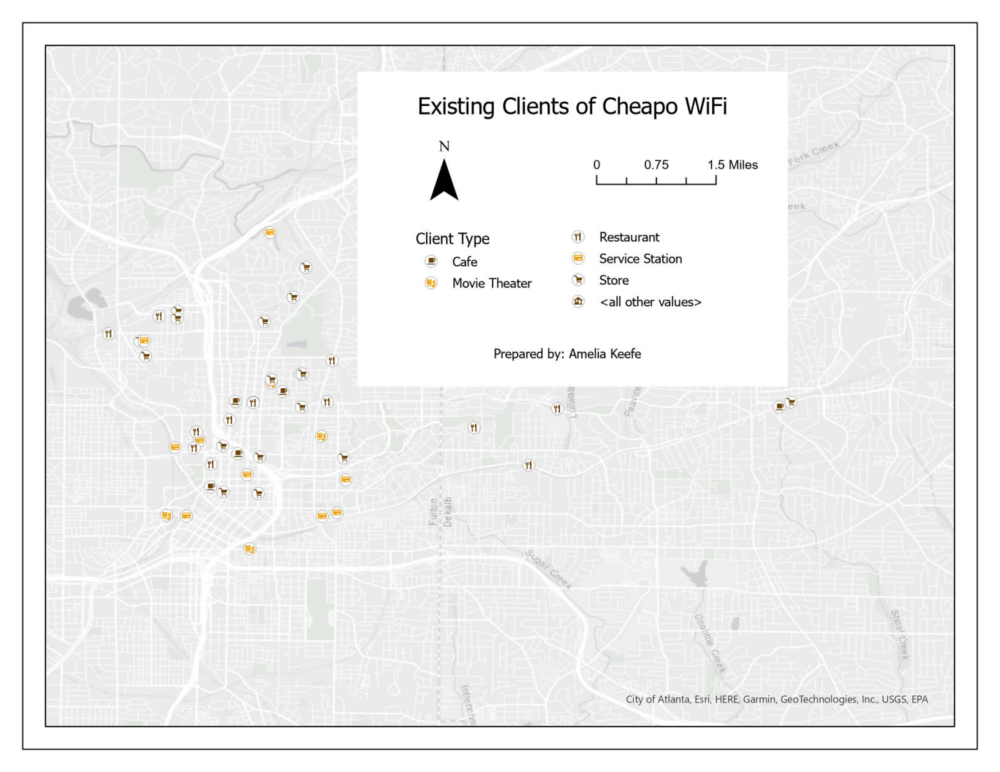

# Lab #06 - Address Geocoding in Atlanta

**Date:** November 2024  
**Course:** GIS 3043C 
**Tools:** ArcGIS Pro  

## Overview
Geocoded customer address data within the Atlanta metropolitan area using a custom-built composite address locator. Created a professional map layout titled "Existing Clients of Cheapo WiFi" to display and categorize client locations across the region.

## Methods
* **Data Preparation & Geocoding:** Processed tabular customer address data and matched records against the custom Atlanta street address locator to generate spatially accurate point feature classes.
* **Symbolization & Classification:** Applied distinct, custom point symbols to represent different client business types (such as restaurants, service stations, and retail locations) to maximize map readability and visual contrast.
* **Basemap Integration:** Integrated the ArcGIS Online Light Gray Canvas basemap to maintain a clean aesthetic and ensure point features stood out clearly.
* **Layout Design & Export:** Optimized the map scale to minimize unused whitespace and maximize the map body footprint. Integrated essential cartographic elements including a title, legend, scale bar, north arrow, neatline, and student name, exporting the final layout to `Lab_06_Keefe.pdf`.

## Skills Demonstrated
* Composite Address Locator Creation & Batch Geocoding
* Custom Point Symbolization & Categorical Differentiation
* Scale Management & Professional Map Layout Optimization
* Basemap Integration & Cartographic Hierarchy

## Outputs

---
[← Back to Portfolio](../index.md)
