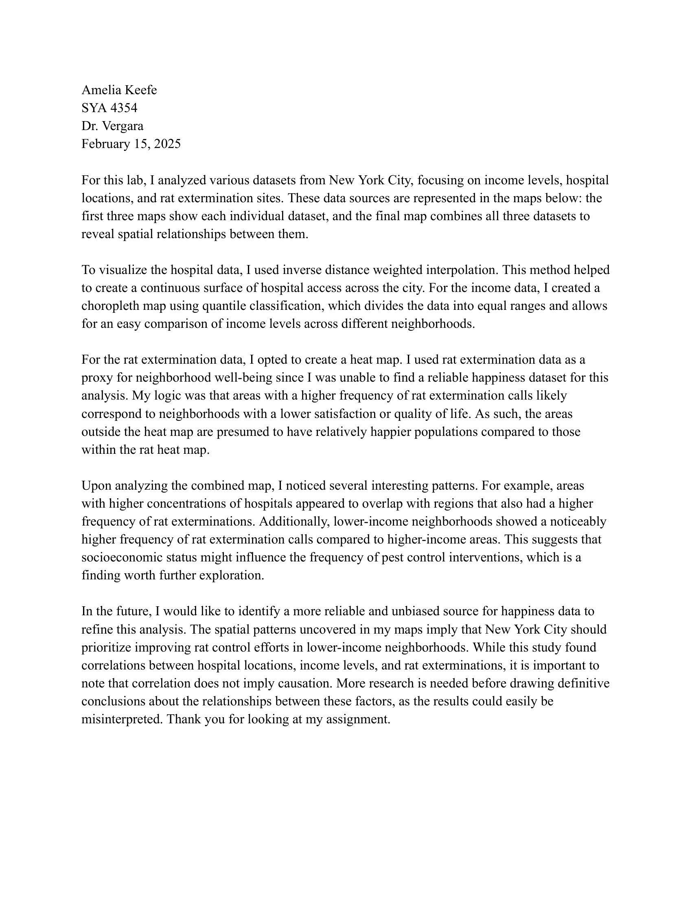
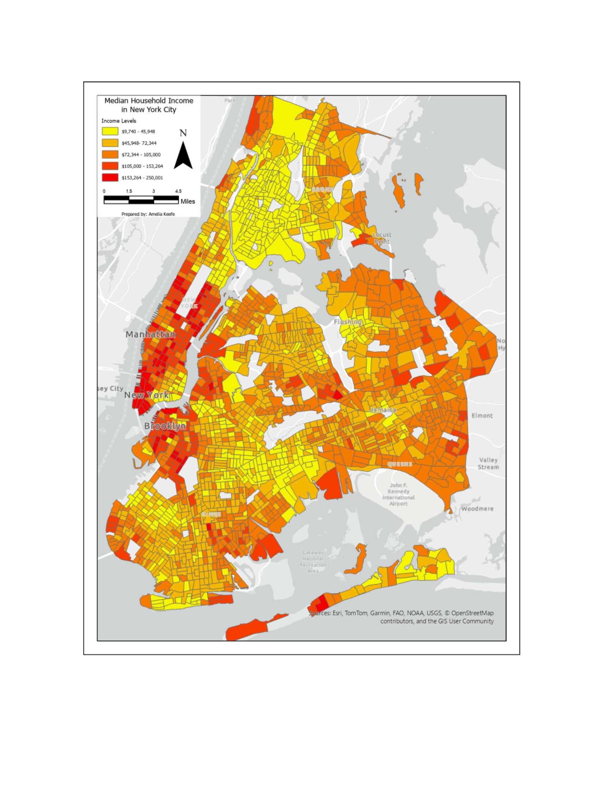
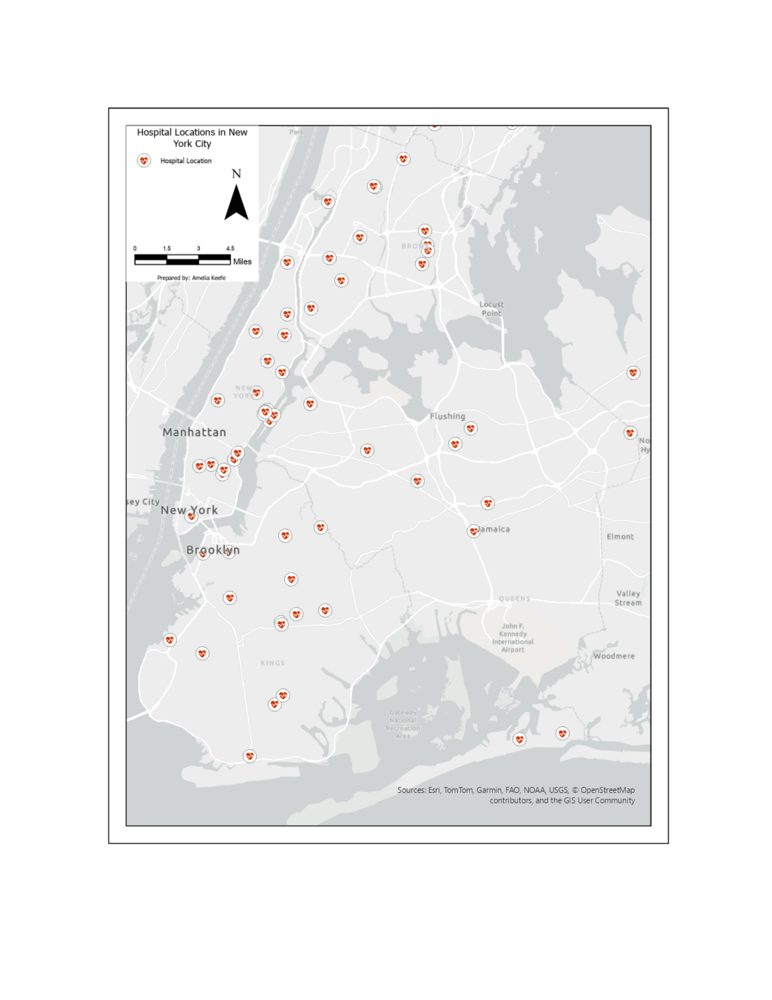
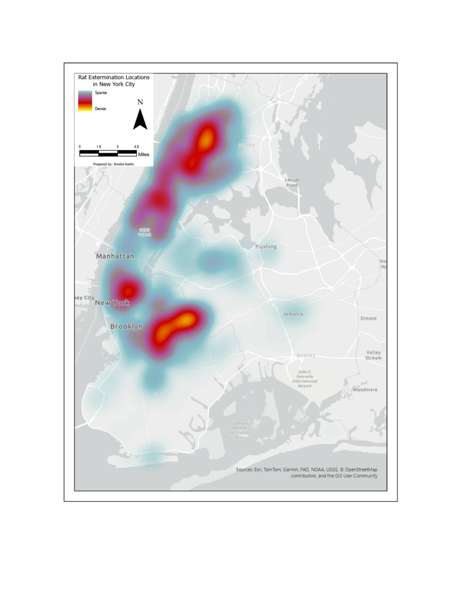
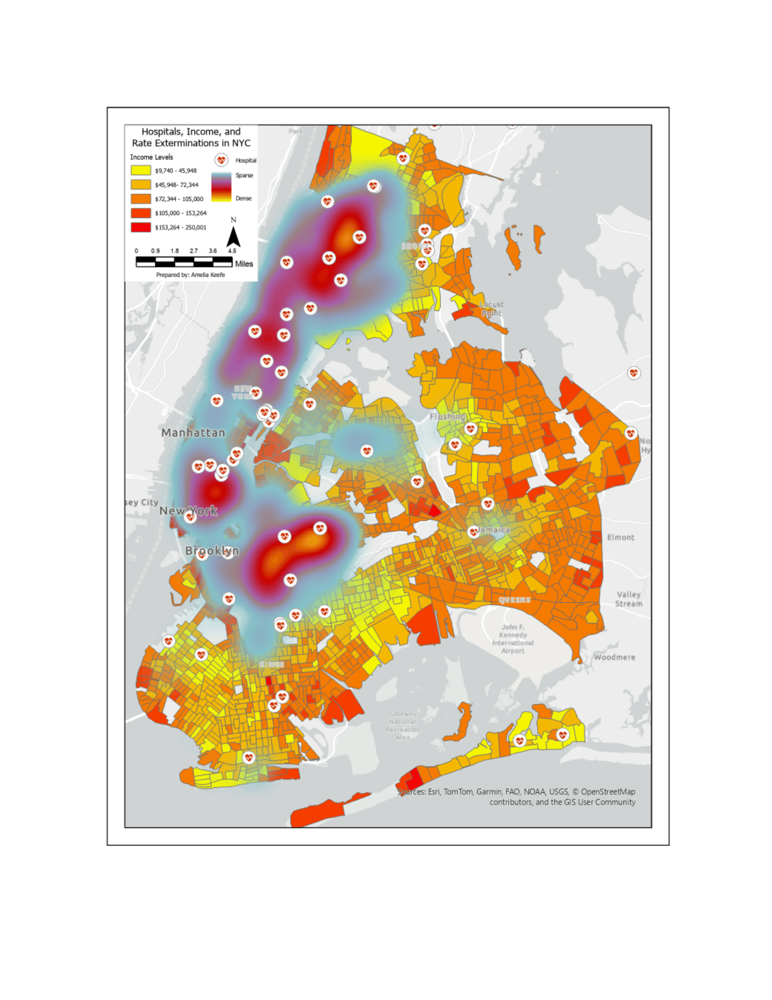

# Lab #3: GIS and Small-Area Estimation of Income, Well-Being, and Happiness

**Date:** February 2025  
**Course:** SYA 4354  
**Tools:** ArcGIS Pro, Inverse Distance Weighted (IDW) Interpolation, Heat Mapping  

## Overview
Analyzed spatial relationships across New York City by integrating and visualizing three distinct datasets: household income levels, hospital locations, and rat extermination call sites used as a proxy for neighborhood well-being. Created individual thematic maps and a combined overlay to explore socioeconomic disparities and spatial clustering.

## Methods
- **Data Preparation & Integration:** Loaded and cleaned demographic, health, and service datasets for New York City, ensuring uniform coordinate systems and filtering incomplete records.
- **Spatial Interpolation & Heat Mapping:** Applied Inverse Distance Weighted (IDW) interpolation to hospital access data to generate a continuous service surface, and built a density heat map of rat extermination calls as a proxy indicator for neighborhood life satisfaction.
- **Choropleth Classification:** Mapped median household income using a quantile classification scheme to categorize and compare neighborhood wealth across administrative boundaries.
- **Synthesis & Interpretation:** Combined all three thematic datasets to evaluate spatial overlaps between low-income regions, healthcare facility access, and pest control intervention frequencies.

## Skills Demonstrated
- Spatial Interpolation Techniques (IDW) & Heat Map Generation
- Choropleth Mapping & Quantile Data Classification
- Multi-Layer Spatial Overlay & Pattern Interpretation

## Outputs

## Challenges & Solutions
- **Challenge:** Identifying a reliable and unbiased dataset to measure localized human happiness or life satisfaction.  
- **Solution:** Utilized high-frequency rat extermination calls as a spatial proxy for neighborhood quality of life and environmental well-being, noting the need for refined sentiment data in future studies.

## Code/Data
- Data Sources: New York City Open Data, Census Bureau Income Statistics, Municipal Service Records

---
[← Back to Portfolio](../index.md)
