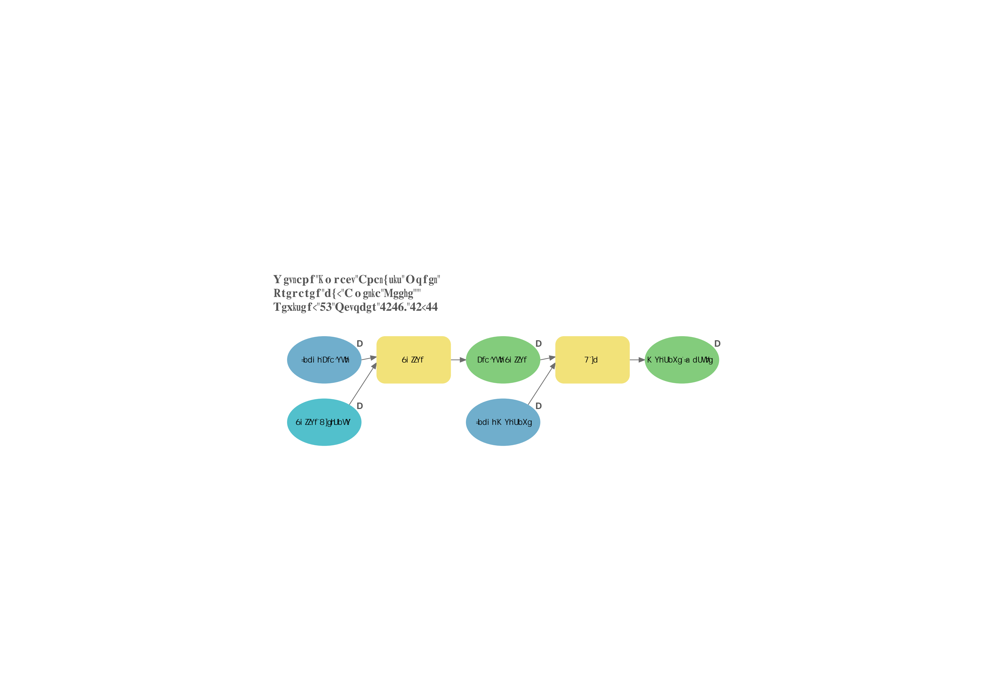
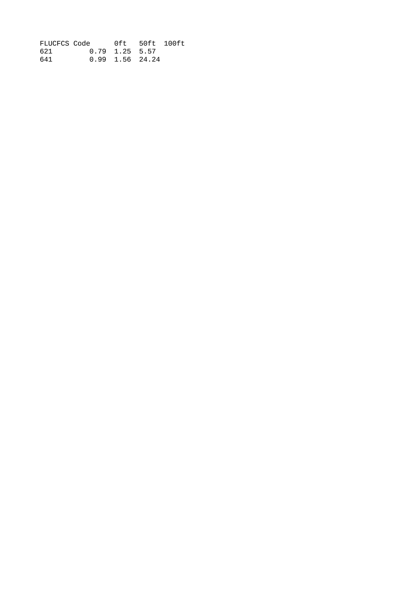

# Lab #05 - Spatial Modelbuilder for Wetland Impacts

**Date:** November 2024  
**Course:** GIS 3043C  
**Tools:** ArcGIS Pro (ModelBuilder)  

## Overview
Automated the wetland impact quantification workflow using ArcGIS Pro ModelBuilder to process multiple construction buffer scenarios (0ft, 50ft, and 100ft). Developed an iterative geoprocessing model and extracted comprehensive acreage impact summaries by FLUCCS code.

## Methods
* **Model Automation:** Designed a customized ModelBuilder workflow incorporating input clip boundaries, buffer generation tools, and intersect functions. Applied dynamic text labeling within the model interface including title, author name, and revision date.
* **Multi-Tier Buffer Analysis:** Executed spatial intersections across three distinct impact zones: the direct factory footprint (`Wetland_Clip_0ft`), a 50-foot construction buffer, and a 100-foot expanded buffer.
* **Quantitative Recalculation & Tabulation:** Recalculated wetland polygon areas under each buffer scenario, aggregating impacted acreage and feature counts by specific FLUCCS codes (including FLUCCS 621 and FLUCCS 641).
* **Documentation & Export:** Exported the complete graphical model schema to a high-resolution PDF (`Model_05_Keefe.pdf`) and generated a structured text summary of multi-tier impact metrics (`gis_chart.txt`).

## Skills Demonstrated
* Geoprocessing Workflow Automation via ArcGIS Pro ModelBuilder
* Multi-Buffer Spatial Intersection & Impact Quantification
* Tabular Data Aggregation & Area Recalculation by FLUCCS Code
* Professional Model Documentation & Layout Export

## Outputs
First model had information jumbled during file conversion
  

---
[← Back to Portfolio](../index.md)
